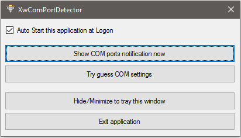
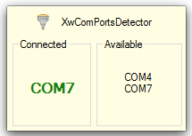
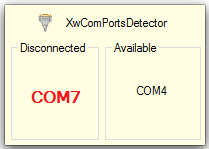
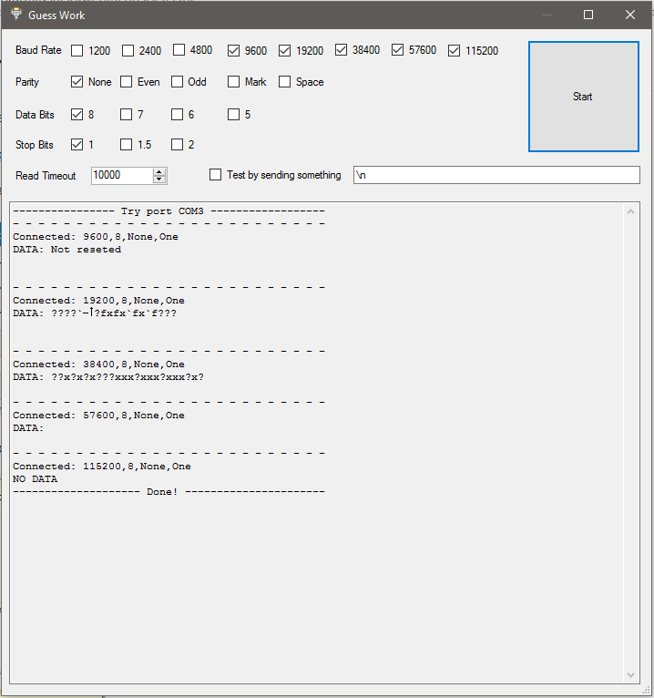

# XwComPortsDetector

A way to detect and notify when COM ports are added or removed from a Windows computer.

Useful when playing around with arduinos and alikes.

This is the main window, where you can set the application to start at logon.

When a new COM Port is added to the machine...

When a COM Port is removed from the machine...

Try to guess the settings of a COM port. 

## In case you are feeling generous  
